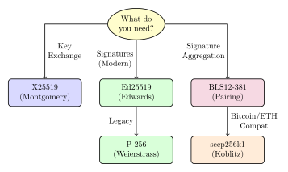
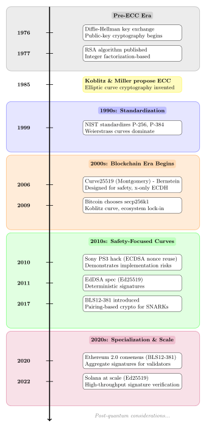

import { Aside } from '@astrojs/starlight/components';

# Appendix A: Elliptic Curve Taxonomy

This appendix provides a comprehensive overview of elliptic curve families used in cryptography, explaining the connection between mathematical properties, algorithmic consequences, and practical utility.

<Aside type="tip">
**For Chapter 1 readers:** This appendix expands on the [Ed25519 vs secp256k1 comparison](/part1/chapter1-core#why-ed25519-over-secp256k1) by exploring the broader landscape of elliptic curve cryptography.
</Aside>

---

## Use Cases: What Are Elliptic Curves Actually For?

Before diving into curve families, let's clarify the three main uses of elliptic curve cryptography:

### 1. Key Exchange (ECDH)

> *"Two parties establish a shared secret over an insecure channel."*

**Problem:** Alice and Bob need to agree on a secret key for symmetric encryption, but all their communication is monitored.

**Solution (Diffie-Hellman):**

```
┌─────────────────────────────────────────────────────────────┐
│                    ECDH Key Exchange Flow                    │
└─────────────────────────────────────────────────────────────┘

    ALICE                                            BOB
    ─────                                            ───

 1. Generate:
    secret_a (private)
    public_a = secret_a × G                   Generate:
                                              secret_b (private)
                                              public_b = secret_b × G

 2. Send public_a ─────────────────────────────────────────>

 3. <─────────────────────────────────────────  Send public_b

 4. Compute:
    shared = secret_a × public_b          Compute:
         = secret_a × secret_b × G        shared = secret_b × public_b
                                               = secret_b × secret_a × G

    ✓ Both parties arrive at the SAME shared secret
    ✓ Eavesdroppers only see public_a and public_b
    ✓ Cannot compute shared without secret_a or secret_b
```
```
Alice: secret_a, public_a = secret_a × G
Bob:   secret_b, public_b = secret_b × G

Alice sends public_a → Bob
Bob sends public_b → Alice

Shared secret:
  Alice computes: secret_a × public_b = secret_a × secret_b × G
  Bob computes:   secret_b × public_a = secret_b × secret_a × G
  ✓ Same value!
```

**Operations needed:**
- Scalar multiplication: `k × P`
- That's it! No signing, no verification.

**Real-world example:**
```
TLS handshake:
  1. Browser and server exchange public keys (ECDH)
  2. Both compute shared secret
  3. Use shared secret for AES encryption
```

---

### 2. Signatures (ECDSA, EdDSA)

> *"Prove you authorized a message without revealing your private key."*

**Problem:** Alice wants to sign a transaction. Anyone should verify it's from Alice, but no one should be able to forge her signature.

**Solution:**

```
┌─────────────────────────────────────────────────────────────────┐
│              EdDSA Signature Flow (Deterministic)                │
└─────────────────────────────────────────────────────────────────┘

SIGNING (Alice - private)          VERIFICATION (Anyone - public)
──────────────────────────          ───────────────────────────────

Input: message, private_key         Input: message, signature, public_key
   │                                    │
   ├─> Hash(private_key || msg)        ├─> Parse signature → (R, s)
   │   = deterministic nonce k          │
   │                                    ├─> Compute hash challenge
   ├─> R = k × G                        │   h = Hash(R || public_key || msg)
   │                                    │
   ├─> s = k + h × private_key          ├─> Check equation:
   │                                    │   s × G ?= R + h × public_key
   └─> Output: (R, s)                   │
                                        └─> Output: ✓ valid / ✗ invalid

Key Advantage: Deterministic nonce k (no RNG failures!)
```

**Operations needed:**
- Point addition: `P + Q`
- Scalar multiplication: `k × P`
- Hashing to scalar
- No secret exchange

**Real-world example:**
```
Bitcoin transaction:
  1. Alice signs: "Transfer 1 BTC to Bob"
  2. Network verifies signature using Alice's public key
  3. If valid, transaction is included in blockchain
```

---

### 3. Encryption (Rarely Used Directly)

> *"ECC is not typically used for encryption directly."*

**Why not?**

| Issue | Problem |
|-------|---------|
| **Message size** | Can only encrypt ~32 bytes at a time |
| **Slow** | ECC operations are expensive |
| **Complex** | Requires encoding message as curve point |

**What we do instead:**

```
Hybrid encryption (like TLS):
  1. Use ECDH to establish shared secret    ← ECC
  2. Use shared secret as AES key           ← Symmetric crypto
  3. Encrypt bulk data with AES             ← Fast & unlimited size
```

**Bottom line:** ECC is used for **key exchange**, then symmetric encryption handles the actual data.

<Aside type="note">
**Why this matters:**
- **Montgomery curves** optimize for key exchange → no need for signatures
- **Edwards curves** optimize for signatures → full group operations
- **Weierstrass curves** do both, but with complexity

Specialized curves are better because they can optimize for their specific use case.
</Aside>

---

## Curve Families: Mathematical Structure → Practical Use

Elliptic curves used in practice fall into **three major families** (plus one special-purpose category):

| Family | Equation Form | Optimized For | Examples |
|--------|---------------|---------------|----------|
| **Weierstrass** | `y² = x³ + ax + b` | General-purpose (legacy) | secp256k1, P-256 |
| **Montgomery** | `By² = x³ + Ax² + x` | Key exchange (ECDH) | X25519, X448 |
| **Edwards** | `ax² + y² = 1 + dx²y²` | Signatures (EdDSA) | Ed25519, Ed448 |
| **Pairing-friendly** | Various | Aggregation, ZK proofs | BLS12-381, BN254 |

```
┌──────────────────────────────────────────────────────────────────────┐
│              Elliptic Curve Family Taxonomy Tree                      │
└──────────────────────────────────────────────────────────────────────┘

                    ELLIPTIC CURVES (for Cryptography)
                               │
        ┌──────────────────────┼──────────────────────┐
        │                      │                      │
   WEIERSTRASS            MONTGOMERY              EDWARDS
   y²=x³+ax+b             By²=x³+Ax²+x           ax²+y²=1+dx²y²
        │                      │                      │
    Use Case:              Use Case:              Use Case:
    Signatures +           Key Exchange           Signatures
    Key Exchange           (ECDH only)            (EdDSA)
        │                      │                      │
    ┌───┴───┐                 │                      │
    │       │                 │                      │
 Generic  Koblitz             │                      │
 P-256   secp256k1         X25519                 Ed25519
         │                 X448                   Ed448
         │
    Faster scalar
    mult (~30%)

            ┌────────────────────────────────────┐
            │      PAIRING-FRIENDLY CURVES        │
            │        (Special Purpose)            │
            ├────────────────────────────────────┤
            │  e: G₁ × G₂ → Gₜ (bilinear map)   │
            │                                    │
            │  Use Cases:                        │
            │  • Signature Aggregation (BLS)     │
            │  • Zero-Knowledge Proofs (SNARKs)  │
            │                                    │
            │  Examples: BLS12-381, BN254        │
            └────────────────────────────────────┘

Legend:
  [Generic] = General-purpose, many use cases
  [Koblitz] = Optimized subclass (endomorphism speedup)
  [Montgomery] = x-coordinate only, constant-time ladder
  [Edwards] = Complete formulas, deterministic signatures
  [Pairing] = Advanced operations, enables aggregation/ZK
```

**Legend:**
- **Generic** = General-purpose, many use cases
- **Koblitz** = Optimized subclass (endomorphism speedup)
- **Montgomery** = x-coordinate only, constant-time ladder
- **Edwards** = Complete formulas, deterministic signatures
- **Pairing** = Advanced operations, enables aggregation/ZK

**Mental model:**
- **Weierstrass** = Swiss Army knife (does everything, but awkward)
- **Montgomery** = Specialized screwdriver (key exchange only, perfect at it)
- **Edwards** = Specialized wrench (signatures only, safe & fast)
- **Pairing-friendly** = Power drill (heavy, but enables new capabilities)

**Quick Visual Decision Tree:**



---

## 1. Short Weierstrass Curves

> *"The original form. Powerful, but with sharp edges."*

### Equation

```
y² = x³ + ax + b
```

### Primary Use Case

**ECDSA Signatures** (and ECDH key exchange)

### Where Used

- **Legacy signatures** (Bitcoin, Ethereum EOAs)
- **FIPS compliance** (P-256, P-384)
- **First-generation blockchains**

### Famous Examples

| Curve | Used By | Primary Use | Notes |
|-------|---------|-------------|-------|
| **secp256k1** | Bitcoin, Ethereum EOAs | Signatures (ECDSA) | Koblitz curve (see below) |
| **secp256r1 (P-256)** | TLS, WebAuthn, HSMs | Signatures, Key Exchange | NIST standard, FIPS certified |
| **secp384r1, secp521r1** | High-security TLS | Signatures, Key Exchange | Larger security margins |

### Mathematical Properties

- General elliptic curve form (most flexible)
- Group law involves:
  - Slope calculation
  - Modular inversion
- Multiple special cases:
  - Point at infinity
  - Point doubling vs addition
- No unified addition formulas

### Algorithmic Consequences

**Branch-heavy implementations:**
```rust
fn add_points(P, Q) {
    if P == infinity {
        return Q;
    }
    if Q == infinity {
        return P;
    }
    if P == Q {
        return double_point(P);  // Different formula!
    }
    if P.x == Q.x {
        return infinity;  // Points are inverses
    }
    // General case... different formula again!
}
```

```
┌──────────────────────────────────────────────────────────────────┐
│         Point Addition Complexity: Weierstrass vs Edwards         │
└──────────────────────────────────────────────────────────────────┘

WEIERSTRASS (Branch-Heavy)          EDWARDS (Branch-Free)
──────────────────────────          ─────────────────────

add_points(P, Q)                    add_points(P, Q)
    │                                   │
    ├─ P = ∞? ──YES──> return Q        │
    │   NO ↓                            │
    │                                   │
    ├─ Q = ∞? ──YES──> return P        │
    │   NO ↓                            └──> ONE FORMULA
    │                                        for ALL cases
    ├─ P = Q? ──YES──> double(P)            │
    │   NO ↓                                 │
    │                                        └──> (x₃, y₃)
    ├─ P.x = Q.x? ──YES──> return ∞
    │   NO ↓
    │
    └──> general_add(P, Q)

Problems:                           Benefits:
• 5 different code paths           • 1 unified formula
• Timing varies by input           • Constant-time friendly
• Hard to audit                    • Fewer bugs
• Secret-dependent branches        • Easy to verify
  → timing attacks                 • No special cases
```

**Challenges for signatures (ECDSA):**
- Requires fresh random scalar `k` per signature
- Modular inversion per signature (slow)
- Many corner cases to handle
- Hard to make constant-time

**Challenges for key exchange:**
- Point validation required (invalid curve attacks)
- More complex than Montgomery curves
- Less clear which coordinate to use as shared secret

### Practical Utility for Signatures

**Why ECDSA fit early systems:**

| Feature | Benefit | Use Case |
|---------|---------|----------|
| Public key recovery | `(hash, r, s) → pubkey` | Smaller blockchain transactions |
| Compact representation | Address = `hash(pubkey)` | Bitcoin/Ethereum addresses |
| Stateless verification | No need to look up pubkey first | Efficient verification |
| General-purpose | Works for signatures AND key exchange | One curve for everything |

**Why blockchains liked them:**
- Ethereum transactions only need signature (not public key) → smaller
- Block headers don't need explicit signer field → simpler
- Compatible with Bitcoin ecosystem

### Why They're Falling Out of Favor

**For signatures:**

| Math Issue | Real-World Failure |
|------------|-------------------|
| Random `k` required | RNG bugs leak private keys |
| Modular inversion | Timing side channels |
| Special cases | Consensus bugs, implementation divergence |
| Non-unified formulas | Hard to audit, fragile constant-time code |

<Aside type="caution">
**Historical ECDSA failures:**
- **Sony PS3 (2010):** Reused `k` value → private key leaked → console jailbroken
- **Android Bitcoin wallets (2013):** Weak RNG → duplicate nonces → funds stolen
- **Multiple timing attacks:** Non-constant-time implementations leaked secrets

These failures drove the industry toward deterministic schemes like EdDSA.
</Aside>

**For key exchange:**
- More complex than Montgomery curves
- Requires careful point validation
- Harder to make constant-time
- Modern systems prefer X25519

> **Systems analogy:** *C with undefined behavior — powerful but dangerous in untrained hands.*

---

### 1.1 Special Case: Koblitz Curves (secp256k1)

**Koblitz curves** are a special subclass of Weierstrass curves with additional algebraic structure.

#### What Makes Them Special

**Efficient endomorphism available:**
```
φ(x, y) = (βx, y)  where β³ ≡ 1 (mod p)

This allows faster scalar multiplication:
  kP = k₁P + k₂φ(P)
where k₁, k₂ are ~half the bit-length of k
```

**Result:** ~30% faster scalar multiplication than generic Weierstrass curves.

#### Example: secp256k1

**Why Bitcoin chose it (2009):**
- Faster verification → important for 2010-era CPUs
- Smaller private keys → fit well in early wallets
- Good performance on mobile devices
- Small optimization win for a resource-constrained network

#### Algorithmic Optimization (GLV Decomposition)

```rust
// Regular scalar mult: k × P requires ~256 point doublings
// With endomorphism: split k into (k₁, k₂) each ~128 bits
//   → compute k₁P + k₂φ(P) with ~128 doublings

fn scalar_mult_glv(k: Scalar, P: Point) -> Point {
    let (k1, k2) = decompose(k);     // Split scalar
    let phi_P = endomorphism(P);     // Efficient map: φ(P)
    k1 * P + k2 * phi_P              // ~30% faster overall
}
```

#### Why They're Rare Outside Bitcoin

| Issue | Impact |
|-------|--------|
| **Niche optimization** | Only ~30% speedup (modern CPUs don't care much) |
| **Security assumptions** | Relies on specific curve structure (less studied) |
| **Complexity** | Harder to implement correctly |
| **Backwards compatibility** | Bitcoin/Ethereum locked in → new chains use simpler curves |

#### Current Status

- **Still dominant in:** Bitcoin, Ethereum EOAs (legacy)
- **Rarely chosen for new designs:** Ed25519 or BLS12-381 preferred
- **Kept alive by:** Bitcoin's massive installed base

> **Mapping:** *Algebraic shortcut → speed → long-term complexity debt*

---

## 2. Montgomery Curves

> *"Scalar multiplication specialists."*

### Equation

```
By² = x³ + Ax² + x
```

### Primary Use Case

**Key Exchange (ECDH)** — and ONLY key exchange.

### Why This Matters

Key exchange needs exactly one operation:
```
shared_secret = my_private_key × their_public_key
```

Montgomery curves optimize ruthlessly for this single operation, discarding everything else.

### Where Used

- **TLS 1.3** (default key exchange)
- **SSH** (recommended default)
- **VPNs** (WireGuard uses X25519 exclusively)
- **Secure messaging** (Signal, WhatsApp)

### Famous Examples

| Curve | Protocol | Adoption |
|-------|----------|----------|
| **Curve25519** | X25519 | TLS, SSH, QUIC, WireGuard, Signal |
| **Curve448** | X448 | Higher security margin (224-bit security) |

### Mathematical Properties

- Special curve form optimized for **scalar multiplication only**
- Works entirely with **x-coordinate** (y-coordinate not needed!)
- Scalar multiplication uses **Montgomery ladder**
- Cofactor handled structurally (no explicit checks)

### Algorithmic Consequences

**Single, simple algorithm (Montgomery ladder):**
```rust
fn x25519(scalar: [u8; 32], point_x: [u8; 32]) -> [u8; 32] {
    // Montgomery ladder - constant-time by construction
    let mut x1 = point_x;
    let mut x2 = 1;  // Identity element (x-coordinate)

    for bit in scalar.bits().reverse() {
        // Constant-time ladder step (no branching on secrets)
        conditional_swap(&mut x1, &mut x2, bit);
        x2 = add(x1, x2);   // x(P+Q) from x(P) and x(Q)
        x1 = double(x1);    // x(2P) from x(P)
        conditional_swap(&mut x1, &mut x2, bit);
    }

    x1  // Only x-coordinate returned (y not needed!)
}
```

```
┌──────────────────────────────────────────────────────────────┐
│         Montgomery Ladder Algorithm (Constant-Time)           │
└──────────────────────────────────────────────────────────────┘

Goal: Compute k × P where k = 1011₂ (binary: 11 in decimal)

Initial:  R₀ = O (identity)     R₁ = P

Bit scan (left to right, starting from bit 1):
─────────────────────────────────────────────────

Step 1: Process bit 1 (set)
    R₀ ← R₀ + R₁ = O + P = P
    R₁ ← 2R₁ = 2P
    State: R₀ = P, R₁ = 2P

Step 2: Process bit 0 (unset)
    R₁ ← R₀ + R₁ = P + 2P = 3P
    R₀ ← 2R₀ = 2P
    State: R₀ = 2P, R₁ = 3P

Step 3: Process bit 1 (set)
    R₀ ← R₀ + R₁ = 2P + 3P = 5P
    R₁ ← 2R₁ = 6P
    State: R₀ = 5P, R₁ = 6P

Step 4: Process bit 1 (set)
    R₀ ← R₀ + R₁ = 5P + 6P = 11P  ✓ Result!
    R₁ ← 2R₁ = 12P

Result: k × P = 11P

Key Properties:
• Same operations regardless of bit value → constant-time
• Only x-coordinates needed throughout
• No branching on secret data (k bits)
• Conditional swap based on bit, but swap is constant-time
```

**Key properties:**
- **No branching** on secret data (constant-time by design)
- **No point addition API** exposed (only scalar mult)
- **x-coordinate only** (simpler, smaller)
- **Natural constant-time** (algorithm structure enforces it)

### Practical Utility for Key Exchange

**Why this is perfect for ECDH:**

| Property | Benefit |
|----------|---------|
| x-only arithmetic | Simpler implementation, smaller keys |
| Montgomery ladder | Constant-time by default |
| No point validation | Algorithm is safe even with invalid points |
| ~200 lines of code | Easy to audit |
| Extremely fast | ~50,000 operations/sec on modern CPUs |

**Real-world adoption:**
```
TLS 1.3:     X25519 is mandatory-to-implement
SSH:         X25519 widely deployed as default
WireGuard:   Uses X25519 exclusively (no alternatives)
Signal:      X25519 for initial key agreement
Tor:         X25519 in v3 onion services
```

> **Mapping:** *x-only arithmetic → simple ladder → side-channel resistance → safe DH*

### Why It's NOT Used for Signatures

**Signatures need operations Montgomery curves don't provide:**

| Signature Requirement | Montgomery Curve Issue |
|----------------------|----------------------|
| Point addition `P + Q` | Only scalar mult available |
| y-coordinate | Only x-coordinate exists in API |
| Hashing to curve | Complex without full group structure |
| Verification equations | Need full point representation |

**Hence: DH yes, signatures no.**

**What about Curve25519 signatures?**

You can't sign with X25519 directly. Instead:
- **Convert to Edwards form** → Ed25519
- Same underlying field, different representation
- Ed25519 for signatures, X25519 for key exchange

---

## 3. Twisted Edwards Curves

> *"Designed for humans, not just mathematicians."*

### Equation

```
ax² + y² = 1 + dx²y²
```

### Primary Use Case

**Signatures (EdDSA)** — the safe, modern replacement for ECDSA.

### Where Used

- **Modern signatures** (prioritizing safety over legacy compatibility)
- **Secure messaging** (Signal, Wire)
- **Blockchain** (Solana, Cardano, Tezos)
- **Infrastructure** (SSH, Tor, DNSSEC)

### Famous Examples

| Curve | Scheme | Adoption |
|-------|--------|----------|
| **Ed25519** | EdDSA | SSH, Signal, libsodium, Solana, Tor v3 |
| **Ed448** | EdDSA | Higher security margin (224-bit security) |

### Mathematical Properties

- Curve form admits **complete addition formulas**
- **No exceptional cases:**
  ```
  P + Q always works (same formula for all inputs)
  P + P works (doubling)
  P + infinity works
  P + (-P) works
  ```
- Efficient representation
- Symmetric group structure

### Algorithmic Consequences

**One formula for everything:**
```rust
fn add_points(P, Q) -> Point {
    // Unified addition formula - works for ALL cases:
    // - P + Q (general case)
    // - P + P (doubling)
    // - P + infinity
    // - P + (-P)
    // NO BRANCHING NEEDED!

    let (x1, y1) = P;
    let (x2, y2) = Q;

    let x3 = (x1*y2 + y1*x2) / (1 + d*x1*x2*y1*y2);
    let y3 = (y1*y2 - a*x1*x2) / (1 - d*x1*x2*y1*y2);

    (x3, y3)
}
```

**Deterministic signature construction (EdDSA):**
```rust
// EdDSA - no randomness needed!
fn sign(message: &[u8], secret_key: &[u8]) -> Signature {
    let k = hash(secret_key || message);  // Deterministic nonce
    let r = k * G;
    let s = k + hash(r || pubkey || message) * secret_key;
    Signature { r, s }
}

// Compare to ECDSA (dangerous!):
fn sign_ecdsa(message: &[u8], secret_key: &[u8]) -> Signature {
    let k = random();  // ⚠️ Must be fresh, unpredictable, never reused!
    // Single bit of k repetition = private key leaked
    // ...
}
```

### Practical Utility for Signatures

**Why EdDSA is safer than ECDSA:**

| Math Property | Implementation Effect | Security Benefit |
|---------------|----------------------|------------------|
| Complete formulas | No corner-case bugs | Fewer implementation vulnerabilities |
| Deterministic nonce | No RNG failures | Immune to nonce-reuse attacks (PS3, Android) |
| Fast addition | Faster signing & verify | 5-10x faster than ECDSA |
| Small implementations | ~1-2k LOC | Easier to audit, formally verify |
| Constant-time friendly | Branch-free code | Resistant to timing attacks |

**Real-world examples:**
```
Signal:     Ed25519 for identity keys
SSH:        Ed25519 recommended default (since ~2014)
libsodium:  Ed25519 is THE signature primitive
Solana:     Ed25519 for all transactions
Tor:        Ed25519 for v3 onion addresses
Zcash:      Ed25519 for Sapling addresses
```

> **Mapping:** *Complete group law → branch-free code → fewer exploits → mainstream adoption*

### Why Edwards ≠ Montgomery (But They're Related)

**Same underlying field, different views:**

```
┌───────────────────────────────────────────────────────────────────┐
│        Curve25519: Two Views of the Same Underlying Curve         │
└───────────────────────────────────────────────────────────────────┘

              SAME UNDERLYING ALGEBRAIC STRUCTURE
                   (𝔽p where p = 2²⁵⁵-19)
                            │
        ┌───────────────────┴───────────────────┐
        │                                       │
        ↓                                       ↓

 MONTGOMERY FORM                         EDWARDS FORM
 By² = x³ + Ax² + x                     ax² + y² = 1 + dx²y²
        │                                       │
   X25519 (ECDH)                          Ed25519 (EdDSA)
        │                                       │
┌───────┴────────┐                    ┌────────┴─────────┐
│ • x-only       │                    │ • Full (x,y)     │
│ • Ladder       │                    │ • Complete add   │
│ • Key exchange │                    │ • Signatures     │
│ • 200 LOC      │                    │ • 2000 LOC       │
└────────────────┘                    └──────────────────┘
        │                                       │
        └───────────────────┬───────────────────┘
                            │
                  Birational Equivalence
                            │
                  Conversion formulas:
                  ────────────────────
                  Edwards → Montgomery:
                    u = (1+y)/(1-y)
                    v = (coordinate transform)

Protocol Example (Signal):
─────────────────────────
Identity Key: Ed25519 (signatures)
      ↓ convert
Session Key: X25519 (key exchange)
```

| | Montgomery (X25519) | Edwards (Ed25519) |
|--|---------------------|-------------------|
| **Use case** | Key exchange | Signatures |
| **Operations** | Scalar mult only | Full group operations |
| **Coordinates** | x-only | (x, y) |
| **API** | `scalar * point` | `sign()`, `verify()`, `add()`, etc. |
| **Formulas** | Montgomery ladder | Complete Edwards addition |
| **Constant-time** | By construction | By design |

**Why have both?**
- **X25519 for ECDH:** Simpler, faster, x-only is sufficient
- **Ed25519 for signatures:** Need full group structure

> **Think:** Montgomery is an optimized syscall; Edwards is a full language runtime.

**Can you convert between them?**

Yes! They're **birationally equivalent** (same curve, different coordinates):
```rust
// Convert Ed25519 public key to X25519 public key
fn ed25519_to_x25519(ed_pubkey: EdPoint) -> X25519Point {
    // Montgomery x = (1 + y) / (1 - y)
    x25519_key
}
```

Used in protocols like Signal that need both operations on the same key material.

---

## 4. Pairing-Friendly Curves

> *"Curves that talk to other curves."*

### Primary Use Case

**Signature Aggregation & Zero-Knowledge Proofs**

Not for basic signatures or key exchange — this is for advanced applications.

### Mathematical Properties

These support **bilinear pairings** (a special map between groups):
```
e: G₁ × G₂ → Gₜ

Key property: e(aP, bQ) = e(P, Q)^(ab)
```

This bilinearity enables:
- Aggregating many signatures into one
- Verifying complex statements succinctly
- Zero-knowledge proofs

### Where Used

- **BLS signatures** (signature aggregation)
- **Zero-knowledge proofs** (zk-SNARKs, zk-STARKs)
- **Rollups** (verification compression)
- **Ethereum consensus** (validator signatures)

### Famous Examples

| Curve | Used By | Properties |
|-------|---------|------------|
| **BN254** (alt_bn128) | Ethereum precompiles, early zk-SNARKs | Fast pairing, 128-bit security |
| **BLS12-381** | Ethereum consensus, Zcash, Filecoin | 128-bit security, well-studied |

### Algorithmic Consequences

**Enables algebraic "compression" of verifications:**

```rust
// Without pairings: verify N signatures = N operations
fn verify_signatures(messages: &[Message], sigs: &[Sig], pubkeys: &[PubKey]) {
    for i in 0..N {
        assert!(verify(messages[i], sigs[i], pubkeys[i]));
    }
    // O(N) pairing operations
}

// With pairings: verify N signatures = 1 operation!
fn verify_bls_aggregate(messages: &[Message], agg_sig: Sig, pubkeys: &[PubKey]) {
    // Aggregate signature = σ₁ + σ₂ + ... + σₙ
    // Verify with SINGLE pairing check:
    assert!(e(agg_sig, G₂) == Π e(H(mᵢ), pubkeyᵢ));
    // O(1) verification (after linear aggregation)
}
```

### Practical Utility

#### BLS Signatures (Signature Aggregation)

| Property | Outcome |
|----------|---------|
| Bilinearity | Signatures can be added: σ₁ + σ₂ + σ₃ |
| Non-degeneracy | Security holds |
| Efficient pairing | Practical verification |

**Ethereum validators depend on this:**
```
32 ETH validators × 1 signature each = 32 signatures (3 KB)
          ↓ (BLS aggregation)
     1 aggregate signature (96 bytes)

Bandwidth saved: 97% reduction
Verification: 1 operation instead of 32
```

Without BLS aggregation, Ethereum consensus would be impractical.

#### Zero-Knowledge Proofs

**Pairings allow:**
- Succinct verification (proof size independent of computation)
- Constant-size proofs (~200 bytes regardless of statement)
- Efficient proof composition

**Real-world impact:**
```
zk-Rollup proof:
  - Proves 10,000 transactions are valid
  - Proof size: ~200 bytes
  - Verification time: ~5ms
  - Without pairings: Need to verify all 10,000 txs on-chain

Result: Ethereum L2s can scale to 1000s of TPS
```

Without pairing-friendly curves, practical zk-SNARKs don't exist.

> **Mapping:** *Bilinear map → algebraic batching → scalability breakthroughs*

### Trade-offs

**Why these curves are "heavy":**

| Aspect | Cost | Comparison |
|--------|------|------------|
| Arithmetic | ~10-100x slower | vs Ed25519 |
| Key sizes | 48-96 bytes | vs 32 bytes (Ed25519) |
| Complexity | More complex security assumptions | vs simpler ECDLP |
| Setup | Sometimes requires trusted setup | vs setup-free schemes |

**But nothing else does this job.**

When you need aggregation or ZK, pairing-friendly curves are the only option.

---

## What's Actually Used Today

### Internet / TLS

```
Key Exchange:  X25519 (Montgomery)  ← Default in TLS 1.3
Signatures:    Ed25519 (Edwards) or P-256 (legacy)
```

### Blockchains

```
Bitcoin/Ethereum EOAs:   secp256k1 (Weierstrass/Koblitz)  ← Legacy
Ethereum consensus:      BLS12-381 (pairing-friendly)     ← Validators
Ethereum zk precompiles: BN254 (pairing-friendly)         ← Rollups
Solana:                  Ed25519 (Edwards)                ← Modern
Cardano:                 Ed25519 (Edwards)
```

### Secure Messaging

```
Signal:     X25519 (key exchange) + Ed25519 (signatures)
WhatsApp:   X25519 (key exchange)
Noise:      X25519 default
```

### Hardware / Compliance

```
HSMs:         P-256, P-384 (Weierstrass)  ← FIPS certified
TPMs:         P-256 (Weierstrass)
WebAuthn:     P-256 (legacy), Ed25519 (growing)
```

---

## Use Case → Curve Family Mapping

Quick reference for choosing curves:

| What You Need | Recommended Curve | Family | Why |
|---------------|-------------------|--------|-----|
| **Key exchange (ECDH)** | X25519 | Montgomery | Simple, fast, constant-time by default |
| **Signatures (modern)** | Ed25519 | Edwards | Safe, deterministic, complete formulas |
| **Signatures (legacy/compliance)** | P-256 | Weierstrass | FIPS certified, hardware support |
| **Signature aggregation** | BLS12-381 | Pairing-friendly | Only option for aggregation |
| **Zero-knowledge proofs** | BLS12-381 or BN254 | Pairing-friendly | Enables succinct proofs |
| **Bitcoin/Ethereum compatibility** | secp256k1 | Weierstrass (Koblitz) | Ecosystem lock-in |

---

## Design Philosophy Evolution

The industry moved from:

> **"Mathematically elegant curves"** (Weierstrass, 1990s-2000s)

to:

> **"Curves engineered to prevent programmer mistakes"** (Montgomery/Edwards, 2010s+)



**Trend:** Generic → Specialized → Advanced
- **Generic:** Swiss Army knife (Weierstrass)
- **Specialized:** Purpose-built safety (Montgomery/Edwards)
- **Advanced:** Power tools for aggregation & ZK proofs (Pairing-friendly)

### Key Insights

1. **Montgomery curves (X25519):**
   - Minimal API surface → fewer ways to misuse
   - x-only → can't accidentally expose y-coordinate
   - Ladder algorithm → constant-time by default

2. **Edwards curves (Ed25519):**
   - Complete formulas → no corner cases to miss
   - Deterministic signatures → eliminate RNG dependency
   - Small implementations → easier to audit

3. **Specialization wins:**
   - X25519 for ECDH: ~200 LOC, impossible to misuse
   - Ed25519 for signatures: ~2000 LOC, safe by default
   - vs secp256k1 for both: ~10,000 LOC, many footguns

### Systems Analogy

Think of curve families as **APIs shaped by algebra**:

| Curve Family | API Design Philosophy | Systems Parallel |
|--------------|----------------------|------------------|
| **Montgomery** | Minimal surface area (only scalar mult) | Microkernel |
| **Edwards** | Safe general-purpose (complete formulas) | Memory-safe language (Rust) |
| **Pairing curves** | Power tools (enables new capabilities) | GPU (specialized, powerful) |
| **Weierstrass** | Legacy compatibility (works but dangerous) | C (powerful, footguns everywhere) |

---

## If You're Designing a System Today

### Modern Defaults (2024+)

| Use Case | First Choice | Fallback | Avoid |
|----------|-------------|----------|-------|
| **Key exchange** | X25519 | X448 | P-256 ECDH |
| **Signatures** | Ed25519 | Ed448 | ECDSA (any curve) |
| **Aggregation** | BLS12-381 | - | Anything else |
| **Compliance required** | P-256 | P-384 | secp256k1 |

### Anti-Patterns to Avoid

❌ **Don't:** Use ECDSA for new designs (use EdDSA instead)
❌ **Don't:** Use secp256k1 unless Bitcoin/Ethereum compatibility required
❌ **Don't:** Roll your own curve parameters (extremely dangerous)
❌ **Don't:** Use the same key for signatures and encryption
❌ **Don't:** Use Weierstrass curves for key exchange (use Montgomery instead)

✅ **Do:** Use X25519 for key exchange
✅ **Do:** Use Ed25519 for signatures
✅ **Do:** Use BLS12-381 for aggregation/ZK
✅ **Do:** Use separate keys for different operations

---

## Summary Table

| Family | Equation | Primary Use | Strength | Weakness | Examples |
|--------|----------|-------------|----------|----------|----------|
| **Weierstrass** | `y² = x³ + ax + b` | Signatures (legacy) | General-purpose | Complex, error-prone | secp256k1, P-256 |
| ↳ *Koblitz* | (special case) | Signatures (Bitcoin) | ~30% faster | Rare, legacy | secp256k1 |
| **Montgomery** | `By² = x³ + Ax² + x` | Key exchange | Simple, constant-time | Key exchange only | X25519, X448 |
| **Edwards** | `ax² + y² = 1 + dx²y²` | Signatures | Complete formulas, safe | Incompatible with legacy | Ed25519, Ed448 |
| **Pairing-friendly** | Various | Aggregation, ZK | Enables new cryptography | Slow, complex | BLS12-381, BN254 |

---

## Further Reading

### Minichain Documentation

- [Ed25519 vs secp256k1 comparison](/part1/chapter1-core#why-ed25519-over-secp256k1) — Why Minichain uses Ed25519
- [Cryptographic Identities](/part1/chapter1-core#12-cryptographic-identities) — How addresses are derived
- [Transaction Signing](/part1/chapter1-core#signing-transactions) — Signature implementation details

### Papers & Specifications

- [Curve25519 paper (2006)](https://cr.yp.to/ecdh/curve25519-20060209.pdf) — Original Montgomery curve design
- [EdDSA paper (2011)](https://ed25519.cr.yp.to/ed25519-20110926.pdf) — Edwards-curve Digital Signature Algorithm
- [SafeCurves](https://safecurves.cr.yp.to/) — Security criteria for elliptic curves
- [BLS12-381 spec](https://github.com/zkcrypto/bls12_381) — Pairing-friendly curve for zk & consensus

### Historical Context

- [PS3 ECDSA failure (2010)](https://www.bbc.com/news/technology-12116051) — Nonce reuse attack
- [Android Bitcoin wallet vulnerabilities (2013)](https://bitcoin.org/en/alert/2013-08-11-android) — Weak RNG

---

<Aside type="note">
**For Chapter 1 context:** This appendix explains the broader elliptic curve landscape. Minichain uses Ed25519 (Twisted Edwards family) for **signatures** because:
- Complete formulas (no special cases)
- Deterministic signatures (no RNG dependency)
- Easy to implement correctly (~2k LOC)
- Perfect for a learning blockchain

See the [comparison section](/part1/chapter1-core#why-ed25519-over-secp256k1) for why this beats secp256k1 (Weierstrass/Koblitz family) for educational purposes.

If Minichain needed key exchange, we'd use X25519 (Montgomery family). If we needed signature aggregation, we'd use BLS12-381 (pairing-friendly family).
</Aside>
